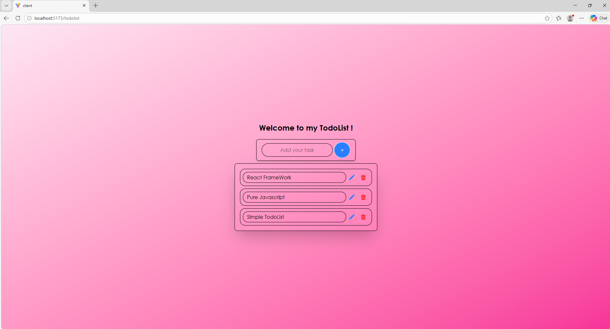

# Todo App

Simple Design Todo List using React JS & TailwindCSS

## 📸 Screenshots

## ✨ Features

- Add todo items
- Edit todos
- Delete todos

## How to Run

1. Install dependencies: `npm install`
2. Run the app: `npm run dev`

## Folder Structure

- frontend/
  - src/ → React components
  - public/ → static assets
  - package.json → project dependencies
